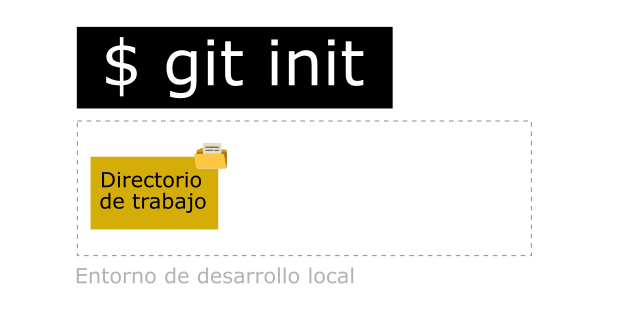

# git-blog
Git Quick Reference Blog - Referencia rápida para usar GIT | Notas personales del Curso de platzi.com

## 1. Preparar un repositorio local.
Permite crear una área de ensayo (staging) en memoria RAM, y una carpeta para la base de datos del repositorio (la carpeta conocida como "/.git/", donde se guardan los cambios atómicos de nuestro código):

```bash
$ git init
```



## 2. Agregar cambios al área de trabajo.
Para mostrar los diferentes estados de los archivos (si estan: "Tracked" o "Untracked") en tu entorno de trabajo, utilice el próximo comando. Si un archivo está "Tracked", este formará parte del área de trabajo (staging):

```bash
$ git status
```

Para observar los cambios entre tu entorno de trabajo y tu área de ensayo (staging):

```bash
$ git diff
```

Para agregar cambios de tu entorno de trabajo a tu área de trabajo (staging). Si utliza ".", se agrega todos los archivos con estado "Untracked" de tu entorno de trabajo a tu área de trabajo (staging). Tambien puedes especificar el nombre individual de un archivo:

```bash
$ git add .
$ git add <nombre_de_archivo>
```

Para desacer el paso anterior, es decir sacar un archivo del áre de trabajo (cambiar el estado "Tracked" a "Untracked"), utilize:

```bash
$ git rm
```

Del paso anterior, si el archivo está en el caché, para remover los cambios agregados de tu área de trabajo (staging), necesitará agregar la badera --cached y el nombre del archivo:

```bash
$ git rm --cached <archivo>
```

## 3. Crear una instantanea del área de trabajo en la base de datos del repositorio.
Para registrar una instantánea permanente de tu área de trabajo (staging) en la base de datos del repositorio. El nombre por defecto del repositorio es "master". Si se omite la bandera -m, Git llamará un editor de texto para completar el comentario, por defecto se usa VIM, pero puede usted programar otros como Visual Studio Code. Todo "commit" con mensajes vacíos, será abortado.

```bash
$ git commit -m "<Comentario>"
```

Recordar que para hacer un "commit", Git necesita saber quienes somos nosotros, para ello necesitas corres estos comandos, en el entorno global de Git:

```bash
$ git config --global user.email "<correo_electronico>"
$ git config --global user.name "<nombre_de_usuario>"
```

Si necesita ver la configuración por defecto de tu "Git", use este comando:

```bash
$ git config --list
```

Si necesita ver donde está guardado la configuración de tu "Git", use este comando:

```bash
$ git config --list --show-origin
```

Una vez realizado el "commit", lo siguiente presenta los cambios en el repositorio:

```bash
$ git log
$ git log <archivo>
```

Lo siguiente presenta los "cambios específicos" de los archivos a partir de creado el "commit". Ante muchos cambios, se usan las fechas "up/donw" para moverse en la pantalla y la tecla "q" para salir:

```bash
$ git log --stat
$ git log --stat <archivo>
```

Si necesita ver con detalle los cambios de un determinado archivo en el repositorio (presentará todos los commit que afectaron al archivo), utilice:

```bash
$ git show <archivo>
```

Para comparar los cambios entre dos imagenes de tu base de datos de repositorio:

```bash
$ git diff <commit-id.old> <commit-id.new>
```

## 4. Traer un archivo de una instantánea del repositorio al entorno de trabajo
Traer la imagen de un archivo, de una instatánea de la base de datos hacia el entorno de trabajo. Es importante conocer la referencia de la instantanea de la base de datos del reposotorio, conocido como <commit-id>, el cual es una cadena de caracteres y números. Se puede reemplazar el <commit-id> por el nombre de la rama, ejemplo "master".
  
```bash
$ git checkout <commit-id> <archivo>
```

## 5. Observar contenido del respositorio
En paso anterior, se mencionó sobre la referencia de la instantanea de la base de datos del repositorio, llamado <commit-id>. El siguiente comando, podrá ver el registro de todos los <commit-id> de la base de datos del repositorio:
  
```bash
$ git log
```

Lo mismo del punto anterior, pero aplicado a un archivos específico:

```bash
$ git log <archivo>
```

## 6. Eliminar cambios del repositorio
Advertencia!!!: Se utiliza sobre todo para deshacer las cosas. Puede borrar todo el historial del repositorio. Uselo entendiendo lo que está haciendo. "Hard" elimina el contenido del área de trabajo (staging), y "Soft" lo mantiene.

```bash
$ git reset --hard
$ git reset --soft
```

Para eliminar archivos del área de trabajo (staging). No para borrarlos del entorno de trabajo, solo para que los últimos cambios de estos archivos no se envíen al próximmo "commit"

```bash
$ git reset HEAD
```

## 7. Sobre flujo de trabajo de un repositorio remoto.
Permite descargar los archivos de la última versión de la rama principal y todo el historial de cambios en la carpeta "/.git/":

```bash
git clone url_del_servidor_remoto
```

Ejecutar este comando para mandar los cambios al servidor remoto:

```bash
git push
```

Para traer actualizaciones del servidor remoto y guardarlas en nuestro repositorio local (en caso de que hayan, por supuesto).

```bash
git fetch
```

Lo necesitamos para combinar los últimos cambios del servidor remoto y nuestro directorio de trabajo:

```bash
git merge
```

Cumple las funciones de "git fetch" y "git merge" al mismo tiempo:

```bash
git pull
```

## 8. Crear una rama.
Basicamente es copiar una rama existente, por lo general "master", para hacer cambios sin afectar la rama principal, siempre se creará desde la rama donde apunta HEAD:

```bash
$ git branch <nombre_de_rama> 
```


## 9. Notas adicionales.
Importante, a GIT no le interesa la carpetas, solo los archivos. Las carpetas son consideradas rutas de los archivos.
Nombre comunes de Ramas: master, development, hotfix.
